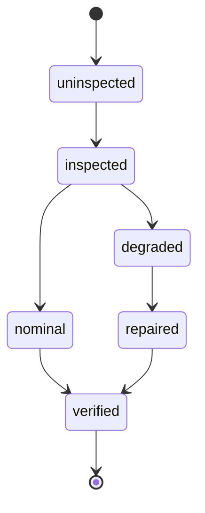
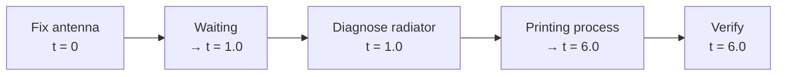

# Structural Maintenance and Repair Verification in Autonomous Orbital Maintenance Platform

This repository contains the PDDL and PDDL+ models developed for assignment **D6-V3: Autonomous Orbital Maintenance Platform — Structural Maintenance and Repair Verification**, together with the corresponding problem instances, generated plans, and the accompanying report.

## Repository structure

```
PDDL/
  Q1/
    Q1_domain.pddl
    Q1_problem1.pddl        # simple instance
    Q1_problem2.pddl        # complex, limited-resource instance
	Q1_testingProblem.pddl  # used for testing an isolate component
  Q2/
    Q2_domain.pddl
    Q2_problem.pddl             		# solvable instance
    Q2_problemInfeasible.pddl    		# demonstrates mission infeasibility due to delay
	Q2_testingProblem.pddl      		# used for testing an isolate component
	Q2_testingProblemExtended.pddl	  	# used for testing an isolate component

Plans/
  Q1/
    Q1_problem1.plan	# solvable instance plan for problem1
    Q1_problem2.plan	# solvable instance plan for problem2
  Q2/
    Q2_antennaLoose_radiatorDeformed.plan   # solvable instance plan
    Q2_infeasibleMission.plan               # empty plan / infeasibility proof

Documents/
	report			# full technical report: design justification, plan analysis, and discussion
	Presentation/	# presentation (.pdf and .pptx format)
```

---

## 1. Domain Description

The domain models a single free-climbing maintenance robot operating on the external structure of an orbital platform. The robot must inspect, diagnose, repair, and verify two external components:

- **Antenna bracket** — the structural support fixing the communication antenna to the platform. Two damage types are modelled: loosening (`is-loose`) and structural cracking (`cracked-bracket`). In the basic PDDL model (Q1) these are treated as independent, separately diagnosable conditions, each with its own dedicated repair action. In the PDDL+ model (Q2) they instead become causally connected stages of the same continuous degradation process, escalating toward a `failed` state if left unaddressed.
- **Radiator** — responsible for thermal control via coolant circulation. Q1 models two independent damage types: a coolant leak (`coolant-leak`) and a structural deformation (`structural-deformation`). Q2 focuses exclusively on the structural deformation path, extending it with an intermediate thermal bowing stage (`thermal-bowing`) to represent a continuous escalation toward failure.

Every maintenance task follows the same causal workflow, which is the core modelling requirement of the assignment:


Repair is never treated as a single unconditional action: the robot must first inspect the component with a compatible sensor, diagnose the specific damage, apply the tool required for that specific damage, and finally verify the repair before the goal can be considered satisfied.

Two problem sets are provided:

- **Q1:** a basic PDDL model with instantaneous actions, used to validate the causal structure of the workflow.
- **Q2:** a PDDL+ extension introducing continuous degradation, discrete failure events, and a continuous repair process, used to study the effect of time on mission feasibility.

## 2. Modelling Choices

### 2.1 Staged component state

Rather than a single boolean "damaged/not damaged" flag, each component moves through an explicit state (`uninspected → inspected → nominal/degraded → repaired → verified`). This was a deliberate choice to keep inspection, diagnosis, repair, and verification as **separate, causally dependent stages** rather than collapsing them into one action, this was required by the assignment and necessary to avoid trivial encodings.

### 2.2 Damage-specific repair actions

Each type of damage has its own repair action with its own required tool and preconditions, rather than a single generic "repair" action:

| Component | Damage | Tool(s) | Repair strategy |
|---|---|---|---|
| Antenna bracket | `is-loose` | `torque-wrench` | Tighten the fastening |
| Antenna bracket | `cracked-bracket` | `grasping-tool` + `spare-bracket` | Physical replacement |
| Radiator (PDDL only) | `coolant-leak` | `coolant-bypass-tool` + coolant reserve | Isolate and refill |
| Radiator | `structural-deformation` | `additive-extruder` + `print-material` | Layer-by-layer 3D printing |
| Radiator (PDDL+ only) | `thermal-bowing` | `thermal-tape` | Mitigate stress before it becomes irreversible |

Although the Q1 domain defines a dedicated action for the radiator's structural deformation (`structural-deformation-reparation`), this specific damage type is intentionally **not exercised** in the Q1 problem instances. The action was introduced in the Q1 domain as groundwork for the continuous model: structural deformation is the damage type around which the Q2 printing process (`apply_printed_layers`) and its staged causal escalation (`thermal-bowing → structural-deformation → failed`) are built, so its instantaneous PDDL counterpart is defined early but deliberately left for Q2 to demonstrate, where its progressive nature can be simulated more accurately.

Note also that Q1 and Q2 are not fully symmetric in their damage coverage: Q2 deliberately **drops `coolant-leak`** entirely (no corresponding process, event, or action exists in the Q2 domain) and focuses only on the structural deformation path. This trade-off was chosen because structural deformation naturally supports a staged causal escalation (`thermal-bowing → structural-deformation → failed`), which is what Q2 is designed to demonstrate, while a coolant leak is closer to a binary condition and does not lend itself to the same continuous degradation modelling.

### 2.3 PDDL+ extension: processes, events, and numeric fluents

The PDDL+ extension introduces three physical mechanisms that cannot be represented with instantaneous discrete actions alone:

- **`:process` continuous degradation** <br>
  `degrade_antenna_phase` continuously increases the antenna's `phase_error` fluent, proportionally to the local `vibration_level` (itself increased by every robot movement). `increased_thermal_strain` continuously increases the radiator's `thermal_strain` fluent, at a rate given by `strain_rate`. These processes model the physical reality that damage does not appear discretely: it accumulates over time as a consequence of the environment and of the robot's own actions.

- **`:event` threshold-triggered state transitions** <br>
  Rather than letting the numeric fluents grow unbounded, discrete `:event` fire automatically once a fluent crosses a physically meaningful threshold, moving the component to the next damage stage without requiring robot intervention: `antenna_becomes_loose` (`phase_error ≥ 0.1`) → `antenna-becomes-cracked` (`≥ 0.2`) → `antenna_failed` (`≥ 0.3`); and for the radiator, `paint_causes_overheating` (accelerates `strain_rate` once `thermal_strain ≥ 5.0`) → `radiator_starts_bowing` (`≥ 10.0`) → `radiator_structural_failure` (`≥ 20.0`) → `radiator_failed` (`≥ 30.0`). This piecewise-linear thresholding was chosen deliberately as a **hybrid abstraction**: it captures the qualitative escalation of physical damage without requiring the planner to reason over continuous differential equations, which would be intractable for a numeric PDDL+ solver.

- **`:process` repair over time** <br>
  The structural deformation repair is not instantaneous: once `start-structural-deformation-reparation` is triggered, the `apply_printed_layers` process deposits material (`layers_printed`) over time until it reaches `layers_to_print`, at which point the `structural_repair_complete` event fires and restores the radiator's thermal fluents to nominal values. This reflects that some physical repairs genuinely take time to execute and cannot be modelled as a single atomic action.

### 2.4 Initial-state simplifications in Q2

To keep the search space tractable for the numeric planner (ENHSP) and avoid combinatorial explosion, the solvable Q2 instance does **not** start from a fully nominal state and let degradation run its full course. Instead:

- Damage is already partially underway at `t = 0` (`phase_error = 0.15`, `thermal_strain = 25.0`).
- The robot starts with all 5 slots pre-equipped with the exact tools required for the mission, instead of having to plan its own trips to and from storage as in Q1.
- **Unidirectional connectivity.** Unlike Q1, where locations are connected bidirectionally to let the robot travel back to storage for tool exchange, the Q2 instances declare `connected` in one direction only (`docking-port → esp-storage → antenna-site → radiator-site`). This is possible precisely because the robot no longer needs to backtrack to storage, having all required tools pre-loaded in its slots from the start.

This is an explicit trade-off: it demonstrates the temporal and physical logic of the continuous model without asking the planner to also solve the full logistics problem from scratch under continuous time, a combination that pushed the solver beyond practical limits during development.

## 3. Plan Walkthrough

### Q1 — Instance 1 (`Q1_problem1.pddl`, simple)

A single antenna bracket starts in the `is-loose` state. The generated plan (15 steps) has the robot shuttle between the storage and the antenna site rather than pre-loading every tool: it retrieves the camera, inspects, diagnoses, returns the camera to storage, retrieves the torque wrench, repairs, and finally retrieves the camera again for verification. **Behaves as expected**: the causal chain inspect → diagnose → repair → verify is respected, and the plan is optimal with respect to the number of trips given only 3 free slots.
```
;;!domain: Q1
;;!problem: Q1-problem1

0.00000: (MOVE R DOCKING-PORT ESP-STORAGE)
0.00100: (UNSTORE-EQUIPMENT R ESP-STORAGE CAM1)
0.00200: (MOVE R ESP-STORAGE ANTENNA-SITE)
0.00300: (INSPECT-COMPONENT R ANTENNA1 ANTENNA-SITE CAM1)
0.00400: (DEGRADED-DIAGNOSIS ANTENNA1 IS-LOOSE CAM1)
0.00500: (MOVE R ANTENNA-SITE ESP-STORAGE)
0.00600: (STORE-EQUIPMENT R ESP-STORAGE CAM1)
0.00700: (UNSTORE-EQUIPMENT R ESP-STORAGE TWRENCH1)
0.00800: (MOVE R ESP-STORAGE ANTENNA-SITE)
0.00900: (LOOSE-ANTENNA-REPARATION R ANTENNA-SITE ANTENNA1 TWRENCH1)
0.01000: (PUT-IN-SLOT R TWRENCH1 SLOT3)
0.01100: (MOVE R ANTENNA-SITE ESP-STORAGE)
0.01200: (UNSTORE-EQUIPMENT R ESP-STORAGE CAM1)
0.01300: (MOVE R ESP-STORAGE ANTENNA-SITE)
0.01400: (REPAIRED-VERIFY R ANTENNA1 ANTENNA-SITE CAM1)

; Makespan: 0.014000000000000005
; Metric: 0.014000000000000005
```

### Q1 — Instance 2 (`Q1_problem2.pddl`, complex, limited resources)

Two components are damaged simultaneously — the antenna (`cracked-bracket`) and the radiator (`coolant-leak`) — with only 3 physical slots available for 6 required tools/parts. The plan (34 steps) does not solve one component fully before starting the other: it interleaves diagnosis and repair across both components, keeping the camera stowed in a slot between uses instead of returning it to storage each time. **Behaves as expected**: it demonstrates the planner's ability to optimize logistics under resource constraints, not just satisfy the causal workflow.
```
;;!domain: Q1
;;!problem: Q1-Testingproblem

0.00000: (MOVE R DOCKING-PORT ESP-STORAGE)
0.00100: (UNSTORE-EQUIPMENT R ESP-STORAGE CAM1)
0.00200: (MOVE R ESP-STORAGE ANTENNA-SITE)
0.00300: (INSPECT-COMPONENT R ANTENNA1 ANTENNA-SITE CAM1)
0.00400: (DEGRADED-DIAGNOSIS ANTENNA1 CRACKED-BRACKET CAM1)
0.00500: (MOVE R ANTENNA-SITE ESP-STORAGE)
0.00600: (PUT-IN-SLOT R CAM1 SLOT1)
0.00700: (UNSTORE-EQUIPMENT R ESP-STORAGE PROFILOMETER1)
0.00800: (MOVE R ESP-STORAGE RADIATOR-SITE)
0.00900: (INSPECT-COMPONENT R RADIATOR1 RADIATOR-SITE PROFILOMETER1)
0.01000: (DEGRADED-DIAGNOSIS RADIATOR1 COOLANT-LEAK PROFILOMETER1)
0.01100: (MOVE R RADIATOR-SITE ESP-STORAGE)
0.01200: (STORE-EQUIPMENT R ESP-STORAGE PROFILOMETER1)
0.01300: (UNSTORE-EQUIPMENT R ESP-STORAGE CRESERVER1)
0.01400: (PUT-IN-SLOT R CRESERVER1 SLOT3)
0.01500: (UNSTORE-EQUIPMENT R ESP-STORAGE CBYPASS1)
0.01600: (MOVE R ESP-STORAGE RADIATOR-SITE)
0.01700: (COOLANT-RADIATOR-REPARATION R RADIATOR-SITE RADIATOR1 CBYPASS1 CRESERVER1 SLOT3)
0.01800: (MOVE R RADIATOR-SITE ESP-STORAGE)
0.01900: (STORE-EQUIPMENT R ESP-STORAGE CBYPASS1)
0.02000: (UNSTORE-EQUIPMENT R ESP-STORAGE PROFILOMETER1)
0.02100: (MOVE R ESP-STORAGE RADIATOR-SITE)
0.02200: (REPAIRED-VERIFY R RADIATOR1 RADIATOR-SITE PROFILOMETER1)
0.02300: (MOVE R RADIATOR-SITE ESP-STORAGE)
0.02400: (STORE-EQUIPMENT R ESP-STORAGE PROFILOMETER1)
0.02500: (UNSTORE-EQUIPMENT R ESP-STORAGE SPARE-BRACKET1)
0.02600: (PUT-IN-SLOT R SPARE-BRACKET1 SLOT2)
0.02700: (UNSTORE-EQUIPMENT R ESP-STORAGE GRASPER1)
0.02800: (MOVE R ESP-STORAGE ANTENNA-SITE)
0.02900: (CRACKED-BRACKET-REPARATION R ANTENNA-SITE ANTENNA1 GRASPER1 SPARE-BRACKET1 SLOT2 ANTENNA1-DEBRIS)
0.03000: (MOVE R ANTENNA-SITE ESP-STORAGE)
0.03100: (STORE-EQUIPMENT R ESP-STORAGE GRASPER1)
0.03200: (MOVE R ESP-STORAGE ANTENNA-SITE)
0.03300: (TAKE-FROM-SLOT R SLOT1 CAM1)
0.03400: (REPAIRED-VERIFY R ANTENNA1 ANTENNA-SITE CAM1)

; Makespan: 0.03400000000000002
; Metric: 0.03400000000000002
```

### Q2 — Solvable instance (`Q2_problem.pddl`)

The antenna is repaired first (all actions at `t = 0`, then a 1-time-unit wait before verification). The robot then moves to the radiator, diagnoses the structural deformation, and starts the printing process, which runs continuously from `t = 1.0` to `t = 6.0` before the radiator can be verified. **Behaves as expected**: the plan correctly waits for the continuous printing process to reach its required threshold before attempting verification, showing that the model correctly synchronizes discrete robot actions with continuous physical processes.
```
;;!domain: Q2
;;!problem: Q2-Problem

0: (move R docking-port esp-storage)
0: (move R esp-storage antenna-site)
0: (take-from-slot R slot1 cam1)
0: (inspect-component R antenna1 antenna-site cam1)
0: (put-in-slot R cam1 slot1)
0: (degraded-diagnosis antenna1 is-loose cam1)
0: (take-from-slot R slot2 twrench1)
0: (loose-antenna-reparation R antenna-site antenna1 twrench1)
0: (put-in-slot R twrench1 slot2)
0: -----waiting---- [1.0]
1.0: (take-from-slot R slot1 cam1)
1.0: (repaired-verify R antenna1 antenna-site cam1)
1.0: (put-in-slot R cam1 slot1)
1.0: (move R antenna-site radiator-site)
1.0: (take-from-slot R slot3 profilometer1)
1.0: (inspect-component R radiator1 radiator-site profilometer1)
1.0: (degraded-diagnosis radiator1 structural-deformation profilometer1)
1.0: (put-in-slot R profilometer1 slot3)
1.0: (take-from-slot R slot5 aextruder1)
1.0: (start-structural-deformation-reparation R radiator-site radiator1 aextruder1 printmat1 slot4)
1.0: -----waiting---- [6.0]
6.0: (put-in-slot R aextruder1 slot5)
6.0: (take-from-slot R slot3 profilometer1)
6.0: (repaired-verify R radiator1 radiator-site profilometer1)

; Makespan: 1
; Metric: 1
```


### Q2 — Infeasible instance (`Q2_problemInfeasible.pddl`)

The radiator starts already close to failure (`thermal_strain = 29.0`, `strain_rate = 2.0`), leaving a mathematical margin of only 0.5 time units before the `radiator_failed` event fires (compared to 20.0 time units in the solvable instance, where `strain_rate = 0.25`). The planner returns **no plan** (59 states evaluated, empty plan). **Behaves as expected**: this is not a solver failure but the intended outcome — it demonstrates that, under continuous dynamics, delaying an intervention past a physically determined deadline makes the mission genuinely infeasible, which is impossible to express in the timeless Q1 model.
```
;;!domain: Q2
;;!problem: Q2-Infeasible

; Makespan: 0
; Metric: 0
; States evaluated: 59
```
## 4. Discussion

Comparing the symbolic (Q1) and continuous (Q2) formulations highlights four points that are central to this assignment.

- **How causal dependencies structure maintenance planning?** <br>
	In Q1, the workflow (inspect → diagnose → repair → verify) is enforced purely through logical preconditions: no action can be executed out of order, regardless of which component or damage is involved. In Q2, this causality extends beyond logic into physics: degradation itself becomes an active causal agent, e.g. the robot's own movement increases `vibration_level`, which in turn drives the antenna's `phase_error` upward, while unmitigated thermal stress on the radiator accelerates its own `strain_rate` through the `paint_causes_overheating` event.

- **How symbolic diagnosis differs from physical diagnosis?** <br>
	A limitation of standard PDDL is that the planner is effectively omniscient: the damage is already declared true in the initial state, and inspection only exists to satisfy the causal chain, not to reveal genuinely unknown information. Q2 mitigates this at the architectural level: damage can, in principle, emerge purely from the evolution of numeric fluents rather than being pre-declared. In practice, however, the provided problem instances were still forced to reintroduce a partially pre-assigned damage state at t = 0 (Section 2.4), since letting both components evolve from a fully nominal state proved computationally intractable for the ENHSP parser within reasonable planning time. The architectural capability is therefore demonstrated in principle by the domain, but not fully exercised by the specific instances solved here.

- **How PDDL+ changes the interpretation of deferred repair?** <br>
	In Q1, delaying a repair has no consequence: a damaged component simply waits, unchanged, until the robot attends to it. In Q2, a delay has a real physical cost. `Q2_problemInfeasible.pddl` demonstrates this directly: with `strain_rate = 2.0` and `thermal_strain` already at 29.0, the robot has only 0.5 time units of margin before the `radiator_failed` event fires, there is not enough time to even begin the inspection sequence, so no plan exists at all.

- **How this model could support future maintenance benchmarks?** <br>
	The gap between offline planning and real robotic execution is visible in the model itself: `layers_to_print` is computed deterministically in Q2, whereas a real robot would rely on closed-loop sensor feedback to know when a repair is physically complete. Similarly, the combinatorial explosion encountered when combining continuous fluents with free slot/inventory management points to the need for better search heuristics before this kind of model could scale to more components or more realistic logistics.

## 5. Limitations and Known Issues

- **Closed-world assumption and determinism** <br>
	The model assumes 100% success on every action and no sensor noise, unlike real diagnostic hardware.
- **No geometric or kinematic representation** <br>
	Locations are discrete topological nodes; movement is instantaneous in both Q1 and Q2. Grasping, tool exchange, and material deposition are represented as symbolic slot operations, not physical manipulation.
- **Boolean, non-negotiable goals** <br>
	The planner cannot perform partial mission success or triage between components (e.g., sacrifice the antenna to save the radiator), the goal is either fully satisfied or the plan fails outright.
- **No explicit prioritization heuristic, and "risk" itself is ambiguous** <br>
	The domain does not encode any cost function based on a component's degradation rate, so the order of intervention emerges implicitly from the search process rather than from an explicit heuristic. This matters because "more at risk" is not a well-defined notion without further specification: in `Q2_problem.pddl`, the radiator has a higher absolute damage value (`thermal_strain = 25.0`) but a wide time-to-failure margin (20 time units, given `strain_rate = 0.25`), while the antenna has a lower absolute value (`phase_error = 0.15`) but a much narrower margin (≈ 3 time units, driven by the local `vibration_level = 0.05`). A heuristic based on absolute damage severity and one based on time-to-failure would therefore prioritize the two components in opposite order; an ambiguity the current model leaves entirely to the underlying search strategy rather than resolving explicitly.
- **Partial pre-assignment of damage in Q2 instances** <br>
	While the domain architecturally supports deriving damage purely from continuous evolution, the provided Q2 problem instances still pre-assign a partially degraded initial state for computational tractability.
- **Combinatorial explosion** <br>
	Introducing continuous numeric fluents together with unconstrained slot/inventory management pushes the ENHSP solver to its practical limits; this is why the Q2 instances constrain the initial logistics rather than leaving them fully open as in Q1.

---

## 6. Running the planner

Q1 and Q2 were solved using different planning back-ends, both configured through the [PDDL VS Code extension](https://marketplace.visualstudio.com/items?itemName=jan-dolejsi.pddl) (Jan Dolejší).

- **Q1** was solved using the extension's built-in **Planning as a Service**, with **BFWS** (Best-First Width Search) selected as the planner. This is a cloud-hosted service requiring no local installation. To reproduce it, open a Q1 problem file in VS Code with the PDDL extension installed and run the *"PDDL: Run the planner and display the plan"* command with BFWS selected as the planning service.

- **Q2** requires **ENHSP-20** (`enhsp-20.jar`, included in `PDDL/Q2/`) running locally, since it needs to support numeric fluents, processes, and events. Two solver configurations were used depending on the specific instance:

  | Configuration | Search strategy | Heuristic | Used for |
  |---|---|---|---|
  | `ENHSP-20 (per Q2)` | `WAStar` | `hrmax` | `Q2_problemInfeasible.pddl`, `Q2_testingProblem.pddl` |
  | `ENHSP-20 (per Q2-Extended)` | `gbfs` | `hadd` | `Q2_problem.pddl`, `Q2_testingProblemExtended.pddl` |

  For the infeasible instance (`Q2_problemInfeasible.pddl`), the expected output is an empty plan together with a report of the number of states evaluated before the search space was exhausted — this is the correct, intended behaviour, not an error.
